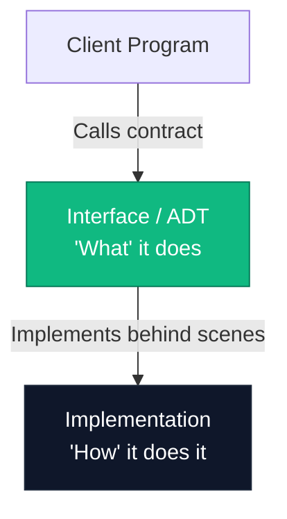
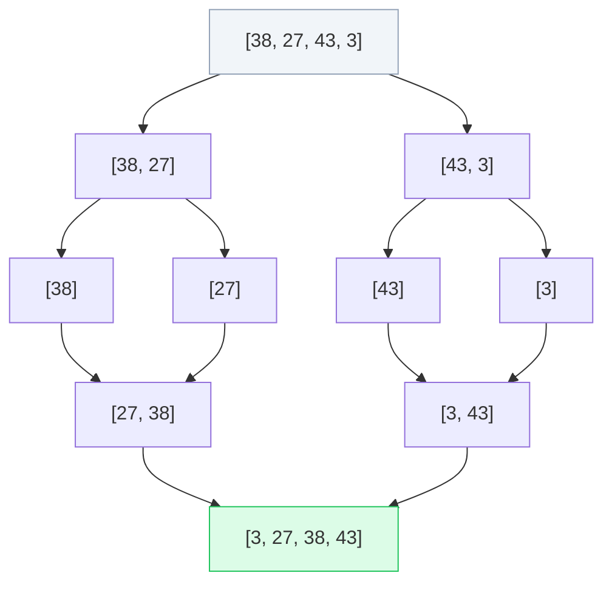

# Unit 1: Introduction to Data Structure & Core Algorithms

Welcome to **Unit 1: Introduction to Data Structure**. This master study guide is designed to provide full-depth learning. It contains clean C++ syntax, detailed diagrams, mathematical formulas, and step-by-step trace tables for sorting and searching algorithms to make studying easy and interactive.

---

## 💡 Table of Contents
1. [Introduction to Data Structures](#1-introduction-to-data-structures)
2. [Data Management Concepts](#2-data-management-concepts)
3. [Interfaces vs. Implementation (ADTs)](#3-interfaces-vs-implementation-adts)
4. [Characteristics of Data Structures](#4-characteristics-of-data-structures)
5. [The Need for Data Structures](#5-the-need-for-data-structures)
6. [Basic Terminology](#6-basic-terminology)
7. [Data Types (Primitive vs. Non-Primitive)](#7-data-types-primitive-vs-non-primitive)
8. [Types of Data Structures (Linear vs. Non-Linear)](#8-types-of-data-structures-linear-vs-non-linear)
9. [Arrays in Detail](#9-arrays-in-detail)
10. [Pointers in Detail](#10-pointers-in-detail)
11. [Structures in Detail](#11-structures-in-detail)
12. [Searching Algorithms (Linear & Binary)](#12-searching-algorithms-linear--binary)
13. [Sorting Algorithms (Bubble, Selection, Quick, Merge)](#13-sorting-algorithms-bubble-selection-quick-merge)

---

## 1. Introduction to Data Structures

A **Data Structure** is a systematic way of organizing, storing, and manipulating data in a computer's memory so that operations can be performed efficiently. It is a combination of data organization, operations, and mathematical rules.

$$\text{Data Structure} = \text{Data Elements} + \text{Relationships} + \text{Operations} + \text{Rules}$$

---

## 2. Data Management Concepts

Data management involves several key operations that can be performed on any data structure:

*   **Insertion**: Adding a new element at a specified position.
*   **Deletion**: Removing an existing element from the structure.
*   **Searching**: Locating the position of a specific target element (called the "key").
*   **Sorting**: Arranging elements in ascending or descending order.
*   **Traversing**: Visiting every element exactly once to process it (e.g., printing elements).
*   **Updating**: Modifying an existing element's value.
*   **Merging**: Combining two separate data structures into a single one.

---

## 3. Interfaces vs. Implementation (ADTs)

In computer science, we separate the logical design of a data structure from its physical coding.



1.  **Interface (Abstract Data Type - ADT)**: Defines the operations supported by the data structure. It only specifies **WHAT** operations can be performed, their input arguments, and return types. It does not write any code.
2.  **Implementation**: The actual concrete code written in a programming language to execute the operations defined by the interface. It defines **HOW** the operations work.

### C++ Code Example (ADT Interface vs. Array Implementation of a Stack)
```cpp
// 1. INTERFACE (Abstract Data Type)
class StackInterface {
public:
    virtual void push(int value) = 0; // Pure Virtual Function
    virtual int pop() = 0;
    virtual bool isEmpty() = 0;
};

// 2. CONCRETE IMPLEMENTATION
class ArrayStack : public StackInterface {
private:
    int arr[100];
    int topIndex;
public:
    ArrayStack() { topIndex = -1; }
    
    void push(int value) override {
        if (topIndex < 99) {
            arr[++topIndex] = value; // Shorthand for incrementing topIndex and inserting
        }
    }
    
    int pop() override {
        if (!isEmpty()) {
            return arr[topIndex--]; // Returns element and decrements index
        }
        return -1; // Stack Underflow error code
    }
    
    bool isEmpty() override {
        return topIndex == -1;
    }
};
```

---

## 4. Characteristics of Data Structures

When choosing a data structure, three characteristics must be evaluated:

1.  **Correctness**: The data structure must correctly implement its interface and handle edge cases (like looking for an item in an empty array) without crashing.
2.  **Time Complexity**: The execution time of operations. We analyze how execution time grows with the input size ($n$) using **Big-O Notation** (e.g., $O(1)$, $O(n)$, $O(n^2)$).
3.  **Space Complexity**: The amount of memory consumed by the data structure during execution.

> [!IMPORTANT]
> **Time-Space Trade-off**:
> You often have to choose between saving time or saving space. For example, a **Hash Table** searches extremely fast ($O(1)$ time) but consumes a lot of memory. An **Array** uses very little memory but searching takes longer ($O(n)$ time).

---

## 5. The Need for Data Structures

As databases and networks grow, simple variables are no longer enough. Data structures solve three major bottlenecks:

*   **Data Search**: Scanning 1 million database records one-by-one is too slow. Efficient structures (like Binary Search Trees or Hash Tables) reduce search steps from 1 million to **less than 20 steps**.
*   **Processor Speed**: High-speed processors still lag if algorithms require quadratic ($O(n^2)$) steps on large data. Efficient data structures optimize algorithms to linear ($O(n)$) or log-linear ($O(n \log n)$) time.
*   **Multiple Requests**: Web servers (like YouTube or Amazon) receive millions of client requests concurrently. They use **Queues** to manage and schedule requests sequentially without crashing.

---

## 6. Basic Terminology

*   **Data**: Raw, unorganized facts. (e.g., `105`, `"Aman"`).
*   **Data Item**: A single unit of value. (e.g., age = `20`).
*   **Group Items**: Data items that can be divided into smaller sub-items. (e.g., `Name` into `First Name` and `Last Name`).
*   **Elementary Items**: Data items that cannot be divided further. (e.g., `Roll Number`, `Gender`).
*   **Entity**: An object with physical or logical existence that holds data. (e.g., a `Student`).
*   **Attribute**: The characteristics describing an entity. (e.g., `RollNo`, `Age`, `Grade` are attributes of a `Student`).
*   **Entity Set**: A collection of similar entities. (e.g., all students in a university).
*   **Field**: A single column or attribute in a database record.
*   **Record**: A collection of related fields describing a single entity (a row in a database table).
*   **File**: A collection of related records.

---

## 7. Data Types (Primitive vs. Non-Primitive)

*   **Primitive Data Types**: Basic, system-defined data types that store a single value and are processed directly by the CPU.
    *   *Examples*: `int`, `char`, `float`, `double`, `bool`.
*   **Non-Primitive Data Types**: User-defined data types created by combining primitive types. They can store multiple values.
    *   *Examples*: Arrays, Structures, Classes, Lists, Stacks.

---

## 8. Types of Data Structures (Linear vs. Non-Linear)

*   **Linear Data Structures**: Elements are arranged in a sequential, straight-line order. Every element (except the first and last) has a unique predecessor and successor.
    *   *Examples*: Arrays, Linked Lists, Stacks, Queues.
*   **Non-Linear Data Structures**: Elements are organized hierarchically or in interconnected networks across multiple levels.
    *   *Examples*: Trees, Graphs.

---

## 9. Arrays in Detail

An **Array** is a linear data structure containing elements of the same data type stored in contiguous (adjacent) memory locations.

```
Index:       0      1      2      3      4
Value:     [10]   [20]   [30]   [40]   [50]
Memory:    2000   2004   2008   2012   2016  (Assuming 4 bytes per integer)
```

### Representation of Arrays in Memory
In a 1D array, the memory address of an element at a specific index $i$ can be calculated mathematically using the **Base Address** (address of the first element at index 0):

$$\text{Address}(A[i]) = \text{Base Address} + i \times \text{Size of one element}$$

*   **Example**:
    If an integer array starts at Base Address `2000`, and each integer occupies `4` bytes, the address of index `3` is:
    $$\text{Address}(A[3]) = 2000 + 3 \times 4 = 2012$$

### Applications of Arrays
1.  **Storing lists of data**: Storing test marks, names, or database rows.
2.  **Implementation of other data structures**: Arrays are used as the foundation to build Stacks, Queues, and Hash Tables.
3.  **Matrix operations**: 2D arrays are used to represent mathematical matrices and graphs.
4.  **CPU Scheduling**: Used to store processes waiting for execution.

---

## 10. Pointers in Detail

A **Pointer** is a special variable that stores the memory address of another variable rather than storing a direct value.

```
Variable:   int val = 10;     (Stored at Address: 0x7ffd2)
Pointer:    int* ptr = &val;  (Points to Address: 0x7ffd2)
```

### Declaring and Initializing Pointers
*   To declare a pointer, use the asterisk `*` symbol.
*   To get the address of a variable, use the address-of operator `&`.
*   To access the value at the address stored in a pointer, use the dereferencing operator `*`.

```cpp
#include <iostream>
using namespace std;

int main() {
    int value = 100;
    int* ptr = &value; // Pointer initialization: ptr stores the address of value

    cout << "Value of variable: " << value << endl;            // Output: 100
    cout << "Address of variable (&value): " << &value << endl; // Output: e.g. 0x7ffd2
    cout << "Address stored in ptr: " << ptr << endl;           // Output: e.g. 0x7ffd2
    cout << "Value dereferenced (*ptr): " << *ptr << endl;     // Output: 100
    
    return 0;
}
```

### Pointer Arithmetic
Pointer arithmetic is different from regular arithmetic. When you add or subtract integers from a pointer, the pointer moves by multiples of the size of the data type it points to.

$$\text{New Address} = \text{Current Address} + (\text{number of steps} \times \text{size of data type})$$

```cpp
#include <iostream>
using namespace std;

int main() {
    int arr[3] = {10, 20, 30};
    int* ptr = arr; // Points to arr[0] (Base Address)

    cout << "Address at index 0: " << ptr << ", Value: " << *ptr << endl; // Output: 10
    
    ptr++; // Increments the pointer. Since it's an int* (4 bytes), it hops forward by 4 bytes.
    cout << "Address after ptr++: " << ptr << ", Value: " << *ptr << endl; // Output: 20 (arr[1])
    
    ptr = ptr + 1; // Hops forward by another 4 bytes.
    cout << "Address after ptr + 1: " << ptr << ", Value: " << *ptr << endl; // Output: 30 (arr[2])
    
    return 0;
}
```

---

## 11. Structures in Detail

A **Structure** is a user-defined data type in C/C++ that allows you to group together variables of different data types under a single name.

### Declaring and Using Structure
```cpp
#include <iostream>
#include <string>
using namespace std;

// 1. DECLARING A STRUCTURE
struct Employee {
    int id;
    string name;
    float salary;
};

int main() {
    // 2. CREATING AND INITIALIZING AN INSTANCE
    Employee emp1;
    emp1.id = 101;
    emp1.name = "John Doe";
    emp1.salary = 50000.50f;

    // 3. ACCESSING MEMBERS
    cout << "Employee Details:" << endl;
    cout << "ID: " << emp1.id << endl;
    cout << "Name: " << emp1.name << endl;
    cout << "Salary: $" << emp1.salary << endl;

    // Using pointers with structures
    Employee* ptr = &emp1;
    cout << "Name accessed via pointer (->): " << ptr->name << endl; // Accessing using arrow operator

    return 0;
}
```

---

## 12. Searching Algorithms (Linear & Binary)

Searching is the process of finding the position of a specific value (key) inside an array.

### 1. Linear Search
*   **Logic**: Scan the array from the first element to the last, comparing each element with the key.
*   **Best Suited For**: Unsorted or small arrays.
*   **C++ Code**:
```cpp
int linearSearch(int arr[], int size, int key) {
    for (int i = 0; i < size; i++) {
        if (arr[i] == key) return i; // Found! Return index.
    }
    return -1; // Not found
}
```
*   **Complexities**:
    *   **Time Complexity**: $O(n)$ in the worst case (the element is at the end or not present).
    *   **Space Complexity**: $O(1)$ (no extra memory used).

---

### 2. Binary Search
*   **Requirement**: The array **MUST be sorted** beforehand.
*   **Logic**: 
    1. Compare the key with the middle element of the array.
    2. If the key matches the middle element, return the index.
    3. If the key is smaller than the middle element, repeat the search in the left half.
    4. If the key is larger, repeat the search in the right half.
    5. Repeat until the pointers meet.

```
Target (Key) = 70
Array: [10, 20, 30, 40, 50, 60, 70, 80, 90]
        L           M                    R   (Mid = 50, 70 > 50 -> search right half)
                    L       M            R   (Mid = 70, Match! Return index 6)
```

*   **C++ Code**:
```cpp
int binarySearch(int arr[], int size, int key) {
    int left = 0;
    int right = size - 1;

    while (left <= right) {
        int mid = left + (right - left) / 2; // Prevents integer overflow

        if (arr[mid] == key) {
            return mid; // Key found!
        }
        if (arr[mid] < key) {
            left = mid + 1; // Key is in the right half
        } else {
            right = mid - 1; // Key is in the left half
        }
    }
    return -1; // Key not found
}
```
*   **Complexities**:
    *   **Time Complexity**: $O(\log n)$ (in each step, we divide the search space in half).
    *   **Space Complexity**: $O(1)$ for iterative approach.

---

## 13. Sorting Algorithms (Bubble, Selection, Quick, Merge)

Sorting means arranging a collection of elements in a specific order (ascending or descending).

---

### 1. Bubble Sort
*   **Logic**: Repeatedly compare adjacent elements and swap them if they are in the wrong order. With each complete pass, the largest unsorted element "bubbles up" to its correct position at the end.
*   **Dry Run Step-by-Step** (Input: `[5, 1, 4, 2]`):
    *   **Pass 1**:
        *   Compare `5` and `1`: $5 > 1 \rightarrow$ Swap $\rightarrow$ `[1, 5, 4, 2]`
        *   Compare `5` and `4`: $5 > 4 \rightarrow$ Swap $\rightarrow$ `[1, 4, 5, 2]`
        *   Compare `5` and `2`: $5 > 2 \rightarrow$ Swap $\rightarrow$ `[1, 4, 2, 5]`
        *   *(End of Pass 1: Largest element `5` is at its correct position at the end)*
    *   **Pass 2**:
        *   Compare `1` and `4`: $1 < 4 \rightarrow$ No swap $\rightarrow$ `[1, 4, 2, 5]`
        *   Compare `4` and `2`: $4 > 2 \rightarrow$ Swap $\rightarrow$ `[1, 2, 4, 5]`
        *   *(Array is sorted, but algorithm completes remaining checks)*

*   **C++ Code**:
```cpp
void bubbleSort(int arr[], int n) {
    for (int i = 0; i < n - 1; i++) {
        bool swapped = false;
        // Last i elements are already in place
        for (int j = 0; j < n - i - 1; j++) {
            if (arr[j] > arr[j + 1]) {
                swap(arr[j], arr[j + 1]);
                swapped = true;
            }
        }
        // If no two elements were swapped by inner loop, then array is sorted.
        if (!swapped) break;
    }
}
```
*   **Complexities**:
    *   **Time Complexity**: Worst/Average: $O(n^2)$, Best: $O(n)$ (if array is already sorted).
    *   **Space Complexity**: $O(1)$ (In-place sorting).

---

### 2. Selection Sort
*   **Logic**: Divide the array into sorted and unsorted sections. Repeatedly find the minimum element from the unsorted section and swap it with the first element of the unsorted section.
*   **Dry Run Step-by-Step** (Input: `[29, 10, 14, 37]`):
    *   **Pass 1**: Find minimum in `[29, 10, 14, 37]` $\rightarrow$ Min is `10`. Swap with index 0 (`29`) $\rightarrow$ `[10, 29, 14, 37]`
    *   **Pass 2**: Find minimum in unsorted part `[29, 14, 37]` $\rightarrow$ Min is `14`. Swap with index 1 (`29`) $\rightarrow$ `[10, 14, 29, 37]`
    *   **Pass 3**: Find minimum in unsorted part `[29, 37]` $\rightarrow$ Min is `29`. Swap with index 2 (`29`) $\rightarrow$ `[10, 14, 29, 37]`
    *   *(Array is sorted)*

*   **C++ Code**:
```cpp
void selectionSort(int arr[], int n) {
    for (int i = 0; i < n - 1; i++) {
        int minIndex = i; // Assume current index holds the minimum
        for (int j = i + 1; j < n; j++) {
            if (arr[j] < arr[minIndex]) {
                minIndex = j; // Update index of minimum element
            }
        }
        // Swap the found minimum element with the first element
        swap(arr[i], arr[minIndex]);
    }
}
```
*   **Complexities**:
    *   **Time Complexity**: $O(n^2)$ in all cases (Best, Worst, Average).
    *   **Space Complexity**: $O(1)$ (In-place sorting).

---

### 3. Quick Sort
*   **Strategy**: **Divide and Conquer**.
*   **Logic**: 
    1. Pick an element as a **pivot** (e.g., the last element).
    2. Partition the array: Move all elements smaller than the pivot to its left and all elements larger to its right.
    3. Recursively apply Quick Sort to the left and right sub-arrays.

```
Input: [10, 80, 30, 90, 40, 50]  (Pivot = 50)
Partition step:
- Values <= 50 shifted left: [10, 30, 40]
- Pivot placed in middle: [50]
- Values > 50 shifted right: [90, 80]
Resulting array: [10, 30, 40, 50, 90, 80]
Recursively sort left [10, 30, 40] and right [90, 80].
```

*   **C++ Code**:
```cpp
int partition(int arr[], int low, int high) {
    int pivot = arr[high]; // Choosing the last element as pivot
    int i = (low - 1);     // Index of smaller element

    for (int j = low; j < high; j++) {
        // If current element is smaller than or equal to pivot
        if (arr[j] <= pivot) {
            i++;
            swap(arr[i], arr[j]);
        }
    }
    swap(arr[i + 1], arr[high]);
    return (i + 1); // Returns partition index
}

void quickSort(int arr[], int low, int high) {
    if (low < high) {
        // pi is partitioning index, arr[p] is now at right place
        int pi = partition(arr, low, high);

        // Recursively sort elements before partition and after partition
        quickSort(arr, low, pi - 1);
        quickSort(arr, pi + 1, high);
    }
}
```
*   **Complexities**:
    *   **Time Complexity**: 
        *   **Average & Best Case**: $O(n \log n)$ (if pivot divides the array roughly in half).
        *   **Worst Case**: $O(n^2)$ (if the array is already sorted and we pick the last element as pivot).
    *   **Space Complexity**: $O(\log n)$ (due to recursive call stack space).

---

### 4. Merge Sort
*   **Strategy**: **Divide and Conquer**.
*   **Logic**:
    1. Divide the unsorted array in half recursively until you have sub-arrays containing only 1 element each (a single element is sorted by default).
    2. Merge the sorted sub-arrays back together to form larger sorted arrays.



*   **C++ Code**:
```cpp
void merge(int arr[], int left, int mid, int right) {
    int n1 = mid - left + 1;
    int n2 = right - mid;

    // Create temporary arrays
    int* L = new int[n1];
    int* R = new int[n2];

    // Copy data to temporary arrays L[] and R[]
    for (int i = 0; i < n1; i++) L[i] = arr[left + i];
    for (int j = 0; j < n2; j++) R[j] = arr[mid + 1 + j];

    // Merge the temporary arrays back into arr[left..right]
    int i = 0, j = 0, k = left;
    while (i < n1 && j < n2) {
        if (L[i] <= R[j]) {
            arr[k] = L[i++];
        } else {
            arr[k] = R[j++];
        }
        k++;
    }

    // Copy the remaining elements of L[], if there are any
    while (i < n1) arr[k++] = L[i++];

    // Copy the remaining elements of R[], if there are any
    while (j < n2) arr[k++] = R[j++];

    // Free dynamically allocated memory
    delete[] L;
    delete[] R;
}

void mergeSort(int arr[], int left, int right) {
    if (left < right) {
        int mid = left + (right - left) / 2;

        // Sort first and second halves
        mergeSort(arr, left, mid);
        mergeSort(arr, mid + 1, right);

        // Merge the sorted halves
        merge(arr, left, mid, right);
    }
}
```
*   **Complexities**:
    *   **Time Complexity**: $O(n \log n)$ in all cases (Best, Worst, Average) because we always divide the array in half and take linear time to merge.
    *   **Space Complexity**: $O(n)$ (requires temporary helper arrays to perform the merging).

---

### Comparison of Sorting Algorithms

| Algorithm | Best Time | Average Time | Worst Time | Space Complexity | Stability |
| :--- | :--- | :--- | :--- | :--- | :--- |
| **Bubble Sort** | $O(n)$ | $O(n^2)$ | $O(n^2)$ | $O(1)$ | Stable |
| **Selection Sort**| $O(n^2)$ | $O(n^2)$ | $O(n^2)$ | $O(1)$ | Unstable |
| **Quick Sort** | $O(n \log n)$| $O(n \log n)$| $O(n^2)$ | $O(\log n)$ | Unstable |
| **Merge Sort** | $O(n \log n)$| $O(n \log n)$| $O(n \log n)$| $O(n)$ | Stable |

---

*End of Unit 1 Master Study Guide. Good luck with your coding practice and exams!*
